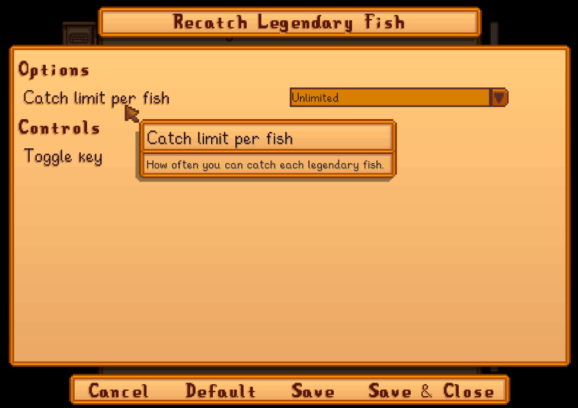

**Recatch Legendary Fish** is a [Stardew Valley](http://stardewvalley.net/) mod which lets you
catch legendary fish again and again.

## Contents
* [Install](#install)
* [Use](#use)
* [Configure](#configure)
* [Compatibility](#compatibility)
* [See also](#see-also)

## Install
1. [Install the latest version of SMAPI](https://smapi.io).
2. Install [this mod from Nexus mods](https://www.nexusmods.com/stardewvalley/mods/172).
3. Run the game using SMAPI.

## Use
Just install the mod and play the game. You'll be able to catch the legendary fish repeatedly.

## Configure
If you install [Generic Mod Config Menu](https://www.nexusmods.com/stardewvalley/mods/5098), you
can click the cog button (⚙) on the title screen or the "mod options" button at the bottom of the
in-game menu to configure the mod. Hover the cursor over a field for details.

## Compatibility
* Works with Stardew Valley 1.6.15+ on Linux/macOS/Windows.
* Works in single-player, multiplayer, and split-screen mode.
* No known mod conflicts.

## See also
* [Release notes](release-notes.md)
* [Nexus mod](https://www.nexusmods.com/stardewvalley/mods/172)
